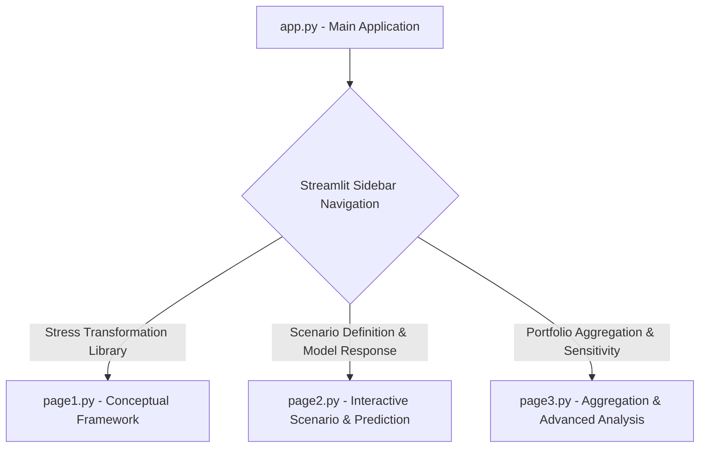

id: 6920cb742c6959ab3fcbf3e4_documentation
summary: Scenario-Based Model Robustness Test - Clone Documentation
feedback link: https://docs.google.com/forms/d/e/1FAIpQLSfWkOK-in_bMMoHSZfcIvAeO58PAH9wrDqcxnJABHaxiDqhSA/viewform?usp=sf_link
environments: Web
status: Published
# QuLab: Scenario-Based Robustness Testing of Financial ML Models

## Introduction to QuLab: Scenario-Based ML Robustness Testing
Duration: 0:05
In this codelab, you will explore **QuLab**, a Streamlit application designed for scenario-based robustness testing of financial Machine Learning (ML) models. This lab provides a comprehensive guide for developers to understand the application's functionalities, core concepts, and its importance in financial modeling.

The primary objective of QuLab is to evaluate how a trained ML model's predictions ($f_\theta(x^{(s)})$) respond to structured stress transformations ($T_s(x)$) applied directly to its input features. This approach is crucial because it allows financial professionals to assess model fragility and ensure compliance with regulatory standards (e.g., SR 11-7) without the computationally expensive process of retraining models for every potential scenario.

This methodology is particularly valuable for:
*   <b>Quantitative Analysts and Model Developers</b>: To understand and improve model stability under adverse conditions.
*   <b>Risk Managers and Model Validators</b>: To perform rigorous robustness assessments and ensure regulatory compliance.
*   <b>CFA/FRM/PRM Candidates</b>: To bridge theoretical stress testing concepts with practical ML implementations.

The core principle involves treating a pre-trained ML model as an object that is subjected to various "what-if" scenarios. Each scenario is formally defined as a transformation $T_s$ applied to the model's feature vector, enabling a systematic analysis of model behavior under plausible adverse events.

### Learning Outcomes
By completing this codelab, participants will be able to:
*   Understand the application of scenario-based stress testing to ML models via feature-level transformations ($T_s(x)$).
*   Translate conceptual financial scenarios into quantifiable shocks on input features.
*   Measure and interpret model sensitivity using various risk-friendly metrics.
*   Identify and analyze model behaviors that exhibit fragility or insufficient conservativeness under stress.
*   Understand how to generate outputs suitable for model validation and governance workflows.

## Application Architecture Overview
Duration: 0:02

The QuLab application is built using Streamlit and organized into three main pages, accessible via a sidebar navigation. This modular structure separates concerns related to defining stress transformations, applying them to a model, and analyzing the aggregated results.

Here's a high-level overview of the application flow:



This architecture ensures a clear progression through the stress testing workflow, from understanding the foundational concepts to performing detailed analysis.

## Step 1: The Stress Transformation Library ($T_s(x)$)
Duration: 0:08

This initial step introduces the fundamental concept of a Stress Transformation Library, which is at the heart of scenario-based robustness testing in QuLab.

### What is a Stress Transformation?
A stress transformation, denoted as $T_s(x)$, is a function designed to modify the input features ($x$) of an ML model according to a specific financial scenario ($s$). The output of this transformation is a "stressed" feature vector, $x^{(s)}$.

The general mathematical form of the transformation used in QuLab is:

$$
x^{(s)} = T_s(x) = x \odot (1 + \delta_s)
$$

Where:
*   $x$ is the original, baseline feature vector.
*   $\delta_s$ is a vector of scenario-specific shocks. Each element in $\delta_s$ quantifies the proportional impact of the scenario on a corresponding feature (e.g., a +20% shock to debt-to-income would mean $\delta_s$ for that feature is 0.20).
*   $\odot$ denotes element-wise multiplication, meaning each feature in $x$ is multiplied by its corresponding $(1 + \delta_s)$ factor.

This formulation allows for a flexible and interpretable way to simulate adverse conditions directly on the model's inputs, rather than altering the model itself.

<aside class="positive">
<b>Why element-wise multiplication?</b> This approach is simple yet powerful for representing proportional shocks to financial features, such as a percentage drop in income or an increase in a ratio. For additive shocks (like basis points for credit spread), $\delta_s$ would be the raw additive change, and the formula would become $x^{(s)} = x + \delta_s$. The current implementation predominantly uses multiplicative shocks for illustrative purposes.
</aside>

### Typical Scenario Types
The versatility of stress transformations allows for the implementation of a wide array of financial scenarios. These can broadly be categorized as:

*   **Macro Downturn:** Scenarios reflecting broad economic contractions. Examples include:
    *   An increase in an unemployment proxy feature.
    *   A reduction in household income.
    *   A rise in credit utilization ratios due to financial strain.
*   **Market Stress:** Scenarios related to adverse movements in financial markets. Examples include:
    *   Higher market volatility.
    *   Lower liquidity indicators.
    *   Widening credit spreads.
*   **Idiosyncratic Borrower Shocks:** Scenarios specific to individual borrowers or entities. Examples include:
    *   A personal income drop.
    *   An increase in delinquency indicators for a specific loan.
    *   A higher Loan-to-Value (LTV) ratio for collateralized loans due to asset depreciation.

By systematically defining and applying these transformations, we can explore how robust our financial models are across a spectrum of plausible adverse events.

### Application Code for `page1.py`

This step is primarily conceptual in the Streamlit application. The `page1.py` file details the mathematical foundation and types of scenarios without interactive elements.

```python
# application_pages/page1.py
import streamlit as st

def run_page1():
    st.header("1. Stress Transformation Library ($T_s(x)$)")
    st.markdown("""
    This section introduces the concept of a Stress Transformation Library, which is a family of transformations $T_s: \mathbb{R}^d \to \mathbb{R}^d$ designed to encode different financial scenarios. For a given feature vector $x$ and a specific scenario $s$, the transformed (stressed) feature vector $x^{(s)}$ is calculated as:

    $$ x^{(s)} = T_s(x) = x \odot (1 + \delta_s) $$

    Where:
    *   $x$ is the original feature vector.
    *   $\delta_s$ is a vector of scenario shocks. These shocks quantify the impact of a scenario on each feature (e.g., +20% debt-to-income, –10% income, +200 bps credit spread).
    *   $\odot$ denotes element-wise multiplication.

    This transformation allows us to simulate the effect of adverse conditions directly on the input features, thereby observing the model's behavior under stress.

    ### Typical Scenario Types

    The types of scenarios that can be implemented through these transformations are diverse and can cover various aspects of financial risk:

    *   **Macro downturn:** This might involve shocks like an increase in unemployment proxy features, a reduction in income, or a rise in credit utilization ratios.
    *   **Market stress:** Scenarios could include higher market volatility, lower liquidity indicators, or widening credit spreads.
    *   **Idiosyncratic borrower shocks:** These are specific to individual borrowers, such as a personal income drop, an increase in delinquency indicators, or a higher Loan-to-Value (LTV) ratio for collateral.

    By defining a library of such transformations, we can systematically explore the robustness of our financial models against a spectrum of plausible adverse events.
    """)
```

To view this step in the application, select "Stress Transformation Library" from the sidebar navigation.

## Step 2: Defining Scenarios and Measuring Model Response
Duration: 0:15

In this step, you will interact with the application to define custom stress scenarios and immediately observe their impact on a hypothetical ML model's predictions. This section covers the setup of a dummy model, interactive scenario definition, and the measurement of both baseline and stressed model responses.

### Setup: Hypothetical Model and Data
To facilitate demonstration, QuLab employs a synthetic dataset and a simple Logistic Regression model. This model simulates a financial prediction task, such as predicting the Probability of Default (PD) for a credit portfolio.

The model uses three primary features: `income`, `debt_to_income_ratio`, and `utilization_rate`. The synthetic data generation is designed such that lower income, higher debt-to-income ratio, and higher utilization generally lead to a higher probability of default.

```python
# Excerpt from application_pages/page2.py
# ...
@st.cache_resource # Use st.cache_resource for objects like models/scalers
def get_model_and_data():
    np.random.seed(42)
    n_samples = 1000
    income = np.random.normal(50000, 15000, n_samples)
    debt_to_income_ratio = np.random.beta(2, 5, n_samples) * 0.5 + 0.1 # Range 0.1 to 0.6
    utilization_rate = np.random.beta(3, 3, n_samples) * 0.8 # Range 0 to 0.8

    # Simulate a target variable (e.g., default) based on features
    prob_default = 1 / (1 + np.exp(-(
        -0.00002 * income +
        5 * debt_to_income_ratio +
        3 * utilization_rate -
        2.5 + np.random.normal(0, 0.5, n_samples)
    )))
    default = (prob_default > np.random.rand(n_samples)).astype(int)

    data = pd.DataFrame({
        'income': income,
        'debt_to_income_ratio': debt_to_income_ratio,
        'utilization_rate': utilization_rate,
        'default': default
    })

    X = data[['income', 'debt_to_income_ratio', 'utilization_rate']]
    y = data['default']

    scaler = StandardScaler()
    X_scaled = scaler.fit_transform(X)

    model = LogisticRegression(solver='liblinear', random_state=42)
    model.fit(X_scaled, y)
    return model, scaler, X, y
# ...
```
<aside class="negative">
<b>Important Note:</b> In a production environment, the model and scaler would typically be pre-trained and loaded, not generated on each run of the page. The `@st.cache_resource` decorator helps mitigate this for repeated calls within the Streamlit app. For consistency and simplicity across `page2.py` and `page3.py` in this demo, the model generation is repeated; in a real app, this would be a shared utility.
</aside>

### Defining Your Scenario Shocks
The application provides a "Scenario Definition Panel" where you can interactively adjust scaling factors for the key features: `Income`, `Debt-to-Income Ratio`, and `Utilization Rate`. These sliders directly control the elements of the $\delta_s$ vector.

*   A scale factor of `1.0` implies no change to the feature.
*   A factor less than `1.0` (e.g., `0.9` for income) represents a decrease.
*   A factor greater than `1.0` (e.g., `1.2` for debt-to-income) represents an increase.

The application calculates the $\delta_s$ vector in real-time based on your selections.

```python
# Excerpt from application_pages/page2.py
# ...
    st.subheader("Define Your Scenario Shocks")
    col1, col2, col3 = st.columns(3)
    with col1:
        income_scale = st.slider("Income Scale Factor", 0.5, 1.5, 1.0, 0.05)
    with col2:
        debt_to_income_scale = st.slider("Debt-to-Income Ratio Scale Factor", 0.5, 1.5, 1.0, 0.05)
    with col3:
        utilization_scale = st.slider("Utilization Rate Scale Factor", 0.5, 1.5, 1.0, 0.05)

    delta_s = np.array([income_scale - 1, debt_to_income_scale - 1, utilization_scale - 1])
    st.markdown(f"Current scenario shocks ($\delta_s$): `{delta_s[0]:.2f}, {delta_s[1]:.2f}, {delta_s[2]:.2f}`")
# ...
```

### Model Response Measurement
Once a scenario is defined, QuLab measures the model's response by comparing baseline predictions with stressed predictions.

*   **Baseline prediction ($\hat{y}$):** The model's prediction using the original, unstressed input features ($x$).
    $$ \hat{y} = f_\theta(x) $$
*   **Stressed prediction ($\hat{y}^{(s)}$):** The model's prediction using the features transformed by the scenario ($x^{(s)}$).
    $$ \hat{y}^{(s)} = f_\theta(x^{(s)}) $$

The primary impact metric is the change in prediction, $\Delta \hat{y}^{(s)} = \hat{y}^{(s)} - \hat{y}$. For credit models predicting Probability of Default (PD), this would be $\Delta PD$.

The transformation process involves:
1.  Obtaining baseline predictions from the `model` using `X_scaled`.
2.  Applying the `delta_s` to the original (unscaled) features `X` to get `X_stressed_values`.
3.  Creating a new DataFrame `X_stressed` and clipping values to ensure realism (e.g., no negative income, ratios between 0 and 1).
4.  Scaling the `X_stressed` features using the *same* `scaler` fitted on the training data.
5.  Obtaining `stressed_predictions` from the `model` using `X_stressed_scaled`.

```python
# Excerpt from application_pages/page2.py
# ...
    baseline_predictions = model.predict_proba(X_scaled)[:, 1]

    # Apply stress transformation to original X, then scale
    X_stressed_values = X.values * (1 + delta_s)
    X_stressed = pd.DataFrame(X_stressed_values, columns=X.columns)
    
    # Ensure no negative values for features that should be non-negative
    X_stressed['income'] = X_stressed['income'].clip(lower=0)
    X_stressed['debt_to_income_ratio'] = X_stressed['debt_to_income_ratio'].clip(lower=0, upper=1)
    X_stressed['utilization_rate'] = X_stressed['utilization_rate'].clip(lower=0, upper=1)

    # Scale the stressed features using the *trained* scaler
    X_stressed_scaled = scaler.transform(X_stressed)

    stressed_predictions = model.predict_proba(X_stressed_scaled)[:, 1]

    delta_predictions = stressed_predictions - baseline_predictions

    st.write(f"Mean Baseline PD: `{np.mean(baseline_predictions):.4f}`")
    st.write(f"Mean Stressed PD: `{np.mean(stressed_predictions):.4f}`")
    st.write(f"Mean Change in PD ($\Delta \hat{y}^{(s)}$): `{np.mean(delta_predictions):.4f}`")
# ...
```

### Distribution of Change in PD
The page then visualizes the distribution of $\Delta PD$ across the individual accounts using a histogram. This gives insights into whether the stress scenario causes a uniform shift in risk or affects certain segments more profoundly.

To interact with this step, select "Scenario Definition & Model Response" from the sidebar. Adjust the sliders and observe how the mean PDs and the histogram of $\Delta PD$ change.

## Step 3: Portfolio Aggregation and Sensitivity Analysis
Duration: 0:15

This final step focuses on aggregating individual model responses to derive meaningful portfolio-level metrics and conducting sensitivity analysis to explore how model behavior changes under varying stress intensities.

### Portfolio-Level Aggregation
Individual changes in model predictions (e.g., $\Delta PD$) are aggregated to provide a holistic view of the model's robustness across the entire portfolio. This involves calculating summary statistics and analyzing risk migrations.

Key portfolio-level metrics demonstrated include:
*   **Mean Probability of Default (PD)**: Comparing the average PD under baseline vs. stressed conditions.
*   **Risk Grade Migration**: Analyzing how many obligors move between predefined risk categories (e.g., Low, Medium, High Risk) due to the stress. This is visualized as a cross-tabulation table.

You can define a new set of stress multipliers for aggregation purposes using sliders, similar to Step 2.

```python
# Excerpt from application_pages/page3.py
# ...
    st.subheader("Portfolio-Level Aggregation")
    # ...
    st.markdown("**Define Stress Scenario for Aggregation:**")
    agg_income_scale = st.slider("Income Scale Factor (for Aggregation)", 0.5, 1.5, 0.9, 0.05)
    agg_dti_scale = st.slider("Debt-to-Income Ratio Scale Factor (for Aggregation)", 0.5, 1.5, 1.2, 0.05)
    agg_util_scale = st.slider("Utilization Rate Scale Factor (for Aggregation)", 0.5, 1.5, 1.1, 0.05)

    delta_s_agg = np.array([agg_income_scale - 1, agg_dti_scale - 1, agg_util_scale - 1])

    X_stressed_values_agg = X.values * (1 + delta_s_agg)
    X_stressed_agg = pd.DataFrame(X_stressed_values_agg, columns=X.columns)
    
    # Ensure non-negative/within bounds
    X_stressed_agg['income'] = X_stressed_agg['income'].clip(lower=0)
    X_stressed_agg['debt_to_income_ratio'] = X_stressed_agg['debt_to_income_ratio'].clip(lower=0, upper=1)
    X_stressed_agg['utilization_rate'] = X_stressed_agg['utilization_rate'].clip(lower=0, upper=1)

    X_stressed_scaled_agg = scaler.transform(X_stressed_agg)
    stressed_predictions_agg = model.predict_proba(X_stressed_scaled_agg)[:, 1]

    df_portfolio = pd.DataFrame({
        'Baseline_PD': baseline_predictions,
        'Stressed_PD': stressed_predictions_agg,
        'PD_Change': stressed_predictions_agg - baseline_predictions
    })

    def get_risk_grade(pd_value):
        if pd_value < 0.05: return 'Low Risk'
        elif pd_value < 0.15: return 'Medium Risk'
        else: return 'High Risk'

    df_portfolio['Baseline_Risk_Grade'] = df_portfolio['Baseline_PD'].apply(get_risk_grade)
    df_portfolio['Stressed_Risk_Grade'] = df_portfolio['Stressed_PD'].apply(get_risk_grade)

    st.write(f"Mean Baseline PD (Portfolio): `{df_portfolio['Baseline_PD'].mean():.4f}`")
    st.write(f"Mean Stressed PD (Portfolio): `{df_portfolio['Stressed_PD'].mean():.4f}`")
    st.write(f"Mean Change in PD (Portfolio): `{df_portfolio['PD_Change'].mean():.4f}`")

    st.subheader("Risk Grade Migration Under Stress")
    grade_migration = pd.crosstab(df_portfolio['Baseline_Risk_Grade'], df_portfolio['Stressed_Risk_Grade'], normalize='index').mul(100).round(2)
    st.dataframe(grade_migration)
# ...
```
The "Risk Grade Migration Under Stress" table provides a powerful visual for risk managers, showing the proportion of accounts that transition between risk grades under the scenario.

### Sensitivity and Nonlinearity Analysis
This advanced analysis technique involves exploring gradual stress paths by introducing a stress intensity factor, $\alpha$. The stressed feature vector is calculated as:

$$
x^{(s,\alpha)} = x \odot (1 + \alpha \cdot \delta_s), \quad \alpha \in [0,1]
$$

Here, $\alpha$ ranges from 0 (baseline, no stress) to 1 (full stress, as defined by $\delta_s$). By plotting the trajectory of the mean model output ($\hat{y}^{(s,\alpha)}$) as $\alpha$ increases, we can identify:
*   **Nonlinear thresholds**: Points where the model's response changes dramatically.
*   **Regions of instability**: Where the model's behavior becomes unpredictable or excessively sensitive.
*   **Acceleration of response**: When small increases in stress lead to disproportionately large changes in output.

You can define the base shocks for income, DTI, and utilization, and the application will plot the mean PD trajectory for 20 $\alpha$ steps.

```python
# Excerpt from application_pages/page3.py
# ...
    st.subheader("Sensitivity and Nonlinearity Analysis")
    st.markdown("""
    This analysis explores gradual stress paths by varying the shock intensity $\alpha$ for a chosen scenario. The transformed features are calculated as:

    $$ x^{(s,\alpha)} = x \odot (1 + \alpha \cdot \delta_s), \quad \alpha \in [0,1] $$
    """)
    st.markdown("**Define a specific scenario for sensitivity analysis:**")
    sens_income_shock = st.number_input("Income Shock (e.g., -0.1 for 10% drop)", value=-0.1, step=0.01, format="%.2f")
    sens_dti_shock = st.number_input("DTI Shock (e.g., 0.2 for 20% increase)", value=0.2, step=0.01, format="%.2f")
    sens_util_shock = st.number_input("Utilization Shock (e.g., 0.15 for 15% increase)", value=0.15, step=0.01, format="%.2f")

    base_delta_s = np.array([sens_income_shock, sens_dti_shock, sens_util_shock])
    alpha_values = np.linspace(0, 1, 20)
    mean_stressed_pds = []

    for alpha in alpha_values:
        alpha_delta_s = alpha * base_delta_s
        X_alpha_stressed_values = X.values * (1 + alpha_delta_s)
        X_alpha_stressed = pd.DataFrame(X_alpha_stressed_values, columns=X.columns)
        
        # Ensure non-negative/within bounds
        X_alpha_stressed['income'] = X_alpha_stressed['income'].clip(lower=0)
        X_alpha_stressed['debt_to_income_ratio'] = X_alpha_stressed['debt_to_income_ratio'].clip(lower=0, upper=1)
        X_alpha_stressed['utilization_rate'] = X_alpha_stressed['utilization_rate'].clip(lower=0, upper=1)

        X_alpha_stressed_scaled = scaler.transform(X_alpha_stressed)
        stressed_predictions_alpha = model.predict_proba(X_alpha_stressed_scaled)[:, 1]
        mean_stressed_pds.append(np.mean(stressed_predictions_alpha))

    fig_sens = go.Figure()
    fig_sens.add_trace(go.Scatter(x=alpha_values, y=mean_stressed_pds, mode='lines+markers', name='Mean Stressed PD'))
    fig_sens.update_layout(title='Mean Stressed PD Trajectory with Increasing Stress Intensity ($\alpha$)',
                           xaxis_title='Stress Intensity ($\alpha$)',
                           yaxis_title='Mean Probability of Default (PD)',
                           hovermode='x unified')
    st.plotly_chart(fig_sens, use_container_width=True)
# ...
```
To access this functionality, navigate to "Portfolio Aggregation & Sensitivity" in the sidebar. Experiment with different base shock values for income, DTI, and utilization to observe how the Mean Stressed PD Trajectory changes.

This concludes the comprehensive guide to QuLab. You have explored the fundamental concepts of scenario-based stress testing, defined interactive scenarios, measured model responses, aggregated impacts at the portfolio level, and performed sensitivity analysis. These capabilities are crucial for robust financial ML model development and validation.
